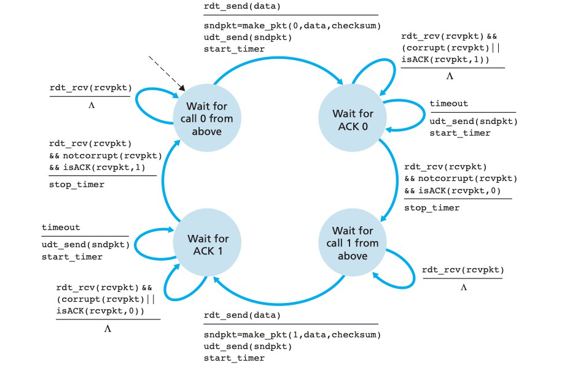
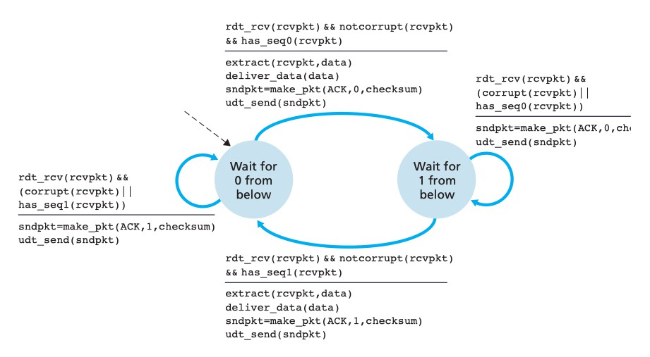
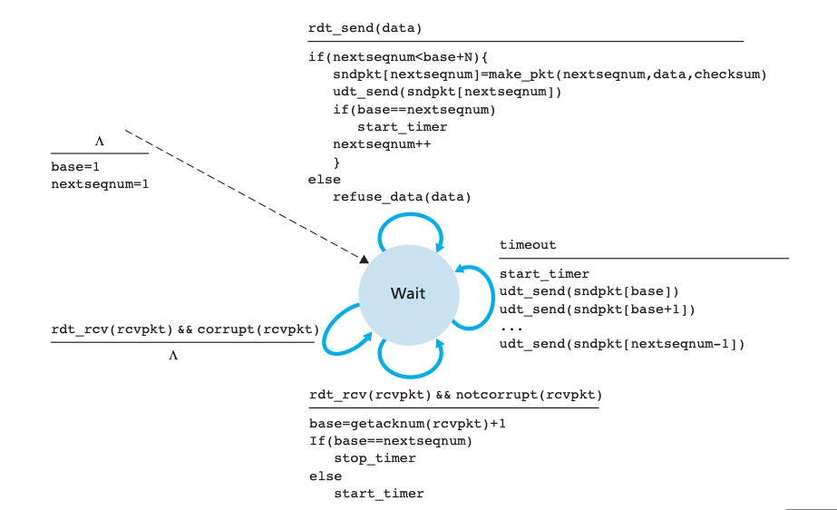
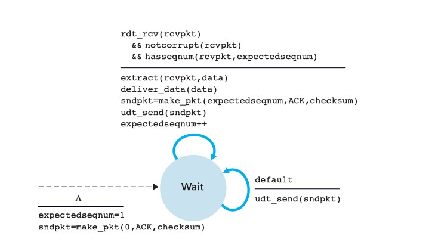

# 设计文档

## 具体原理：

#### 一、rdt3.0

经具有比特差错的丢包信道的可靠数据传输（停等协议）

1、sender 发送的 packet 丢失

2、receiver 发送的 ACK 丢失

**sender 可以选择一个合理的时间段，如果在这个时间段内，它没有收到这个 packet 的 ACK，那么 sender 会 retransmitted.** 但有可能会出现 **duplicate data packets** 在 sender-to-receiver channel 中。可以用 sequence numbers 去处理 duplicate packets 的情况。

sender的FSM

receiver的FSM

#### 二、流水线可靠数据传输

pipelined 协议允许 sender 发送多个 packet 而不用等待 acknowledgments。

增加的要求：

1. 增加序号范围
2. 两端增加缓存
3. 解决流水线差错的办法：GBN，SR

选择GBN协议：被限制在 pipeline 中不能超过指定数量window size的 unacknowledged packets

上图中有2个变量和1个固定的 Window size N，它们所表示的含义：

N：pipeline 中最多的 unacknowledged packets 数量

base：sequence number of the oldest unacknowledged packet

nextseqnum：smallest unused sequence number

[动画演示](https://media.pearsoncmg.com/aw/ecs_kurose_compnetwork_7/cw/content/interactiveanimations/go-back-n-protocol/index.html)

sender的FSM

receiver的FSM

响应三种事件：

1. 确认窗口是否已满
2. 累计确认
3. 重传

bytes

Python中的字节码用`b'xxx'`的形式表示。x可以用字符表示，也可以用ASCII编码形式`\xnn`表示，nn从00-ff(十六进制)共256种字符。

如果想要修改一个字节串中的某个字节，不能够直接修改，需要将其转化为bytearray后再进行修改。

bytes <=> string 字节通过某种编码形式就可以转化为相应的字符。字符通过encode()方法传入编码方式就可以转化为字节，而字节通过decode()方法就可以转化为字符

